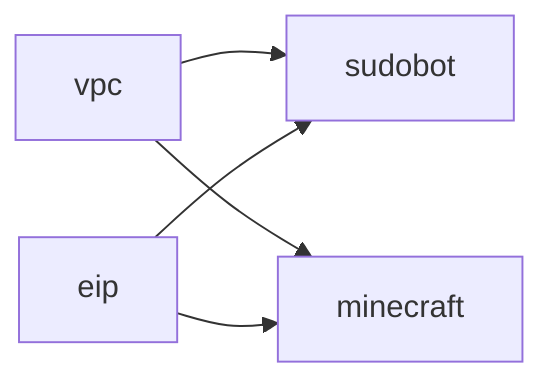

# Cfn Templates

- [Cfn Templates](#cfn-templates)
  - [Overview](#overview)
  - [Deployment Order](#deployment-order)
  - [Cloudformation Templates](#cloudformation-templates)
    - [vpc.yml](#vpcyml)
    - [eip.yml](#eipyml)
    - [sudobot.yml](#sudobotyml)
    - [minecraf.yml](#minecrafyml)

## Overview

Cloudformation templates aimed at a completely automated approach at not only creating the resources, but getting them to the state ansible can take over.

## Deployment Order

## Cloudformation Templates

### vpc.yml

The main networking and base infrastructure for all EC2 instances.

- VPC
- Internet Gateway
- Network ACLs
- Security Groups

#### Network ACLs

##### Ingress

|Port(s)|Cidr Block|Action|
|:--:|:--:|:--:|
|22|0.0.0.0/0|Allow|
|80|0.0.0.0/0|Allow|
|443|0.0.0.0/0|Allow|
|25565-25566|0.0.0.0/0|Allow|
|25575-25576|0.0.0.0/0|Allow|
|*|0.0.0.0/0|Deny|

##### Egress

|Port(s)|Cidr Block|Action|
|:--:|:--:|:--:|
|22|0.0.0.0/0|Allow|
|80|0.0.0.0/0|Allow|
|443|0.0.0.0/0|Allow|
|1024-65535|0.0.0.0/0|Allow|
|*|0.0.0.0/0|Deny|

#### SSH Security Group

|Port(s)|Cidr Block|
|:--:|:--:|
|22|0.0.0.0/0|

#### Web Security Group

|Port(s)|Cidr Block|
|:--:|:--:|
|80|0.0.0.0/0|
|443|0.0.0.0/0|

#### Minecraft Security Group

|Port(s)|Cidr Block|
|:--:|:--:|
|25565-25566|0.0.0.0/0|
|25575-25576|0.0.0.0/0|

#### VPC Exports

|Export Name|Reference Value|
|:--:|:--:|
|main-vpc-id|Id of VPC|
|main-igw|Id of Internet Gateway|
|main-sshsg|Id of SSH Security Group|
|main-websg|Id of Web Security Group|
|main-minecraftsg|Id of minecraft Security Group|
|main-nacl|Id of the main Network ACL|

### eip.yml

Stack that controls all elastic IPs needed for all resources.

- Elastic IPs

#### EIP Exports

|Export Name|Reference Value|
|:--:|:--:|
|sudobot-eip-allocationid|Allocation Id of EIP for SudoBot EC2|
|minecraft-eip-allocationid|Allocation Id of EIP for Minecraft EC2|

### sudobot.yml

Everything needed to stand up an EC2 instance and any other additional infrastructure needed for creating a completely deployable SudoBot instance from scratch to working.

- Subnet
- Subnet + Route Table Association
- Subnet + Network ACL Association
- Route Table
- Routes
- EC2 Instance
- EIP Association

### minecraft.yml

Everything needed to stand up an EC2 instance and any other additional infrastructure needed for creating a completely deployable Minecraft server from scratch to working.

- Subnet
- Subnet + Route Table Association
- Subnet + Network ACL Association
- Route Table
- Routes
- EC2 Instance
- EIP Association
- S3 Bucket
- IAM Role
- IAM Instance Profile